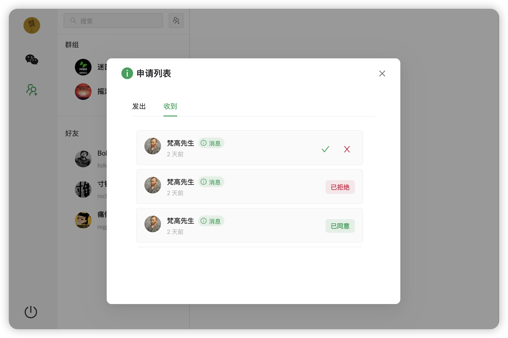

## Go chat web project.

#### Page：
1. ###### Login page
   

2. ###### Chat page
   

3. ###### Group/Friend page
   
   

4. ###### Add friend page
   

4. ###### Request list page
   

## Project Setup

```sh
npm install
```

### Compile and Hot-Reload for Development

```sh
npm run dev
```

### Type-Check, Compile and Minify for Production

```sh
npm run build
```

### Lint with [ESLint](https://eslint.org/)

```sh
npm run lint
```
